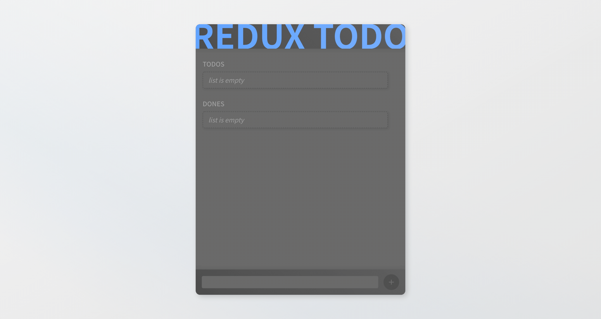

# ReduxTODO

ReduxTODO is just another todo-app where states are managed by [Redux](https://redux.js.org/). The app is composed of three modules, `redux-todo-mongo`, `redux-todo-express` and `redux-todo-react`. Client-side state of a todo list is managed by Redux and it is synced with [MongoDB](https://www.mongodb.com/). [Express](http://expressjs.com/) server places between those two as a HTTP API server.

<br>

## Specification
### Client
- [React](https://reactjs.org/)
  - [Create React App](https://create-react-app.dev/)
- [Redux](https://redux.js.org/)
  - [Redux Thunk](https://github.com/reduxjs/redux-thunk)
- [TypeScript](https://www.typescriptlang.org/)
- [SASS](https://sass-lang.com/)
- [NGINX](https://www.nginx.com/)

### Server
- [Express](http://expressjs.com/)
- [MongoDB](https://www.mongodb.com/)
- [TypeScript](https://www.typescriptlang.org/)

### Deployment
- [Docker](https://www.docker.com/)
  - [Docker Compose](https://docs.docker.com/compose/)

<br>

## Features
### CRUD of Todos

ReduxTODO supports basic CRUD operations on todo list. All the todos and dones are managed by the state management tool, Redux.

|  |
| :-: |
| create and delete |

|  |
| :-: |
| move and edit |

|  |
| :-: |
| mark as done and unmark |

<br>

### Accessibility

ReduxTODO supports keyboard control. All the interactable components would be highlighted with a thick outline so that users can recognize which element is active.

|  |
| :-: |
| keyboard support |

<br>

### Synchronizing with MongoDB

Todo list state is not only stored in Redux but also in MongoDB. When you open the client app, it will fetch the stored data from server. Every updates made on the client-side is applied to DB. To prevent too much HTTP requests being made, updating DB process is debounced with 3 seconds of delay.

|  |
| :-: |
| fetch data from server on start |

|  |
| :-: |
| every update on Redux is applied to DB |

<br>

### Polling

Sometimes a client may not have the latest state if multiple users update a todo list at the same time. A client conducts polling every 10 seconds to check if the client has a stale state by comparing timestamps of server and client. If server has newer timestamp, it means that the server has newer data than the client. A client will fetch the latest data from the server and apply it to the client.

|  |
| :-: |
| poll every 10 seconds to check if server gets updated |

<br>

### Preventing Collision

Even though we conduct polling every 10 seconds, it is still possible for some users to update DB based on a stale state if the update is made before polling. To prevent such collision, a client will compare timestamps also before sending an update to server. If the update is made upon stale state, it would be discarded and not be sent to the server.

|  |
| :-: |
| abort an update if server has been updated since last polling |

<br>

## How to run

### 0. Prerequisite
- [git](https://git-scm.com/)
- [Docker](https://www.docker.com/)
  - if you are using macOS or Windows, [Docker Desktop](https://www.docker.com/products/docker-desktop/) would be the easiest way of using Docker.
  
> Make sure you are not an enterprise user when using Docker Desktop. Because Docker Desktop is only free for personal users.

<br>

### 1. Clone the Repository

```bash
git clone https://github.com/bb-in-hoodie/redux-todo.git
cd redux-todo # move to the redux todo directory
```

Use `git clone` command to clone the remote repository to your local system.

<br>

### 2. Run Docker Compose

```bash
docker compose up
```

Just a single `docker compose up` command will build and run images, connect them with a network, set up a volume to store MongoDB data.

<br>

### 3. Open the React App

Once docker compose is up and running, you can access to the client from any web browser. The default url must be `http://localhost`.

> *port number can be omitted since the default port number for a client is set as `80`*

<br>
